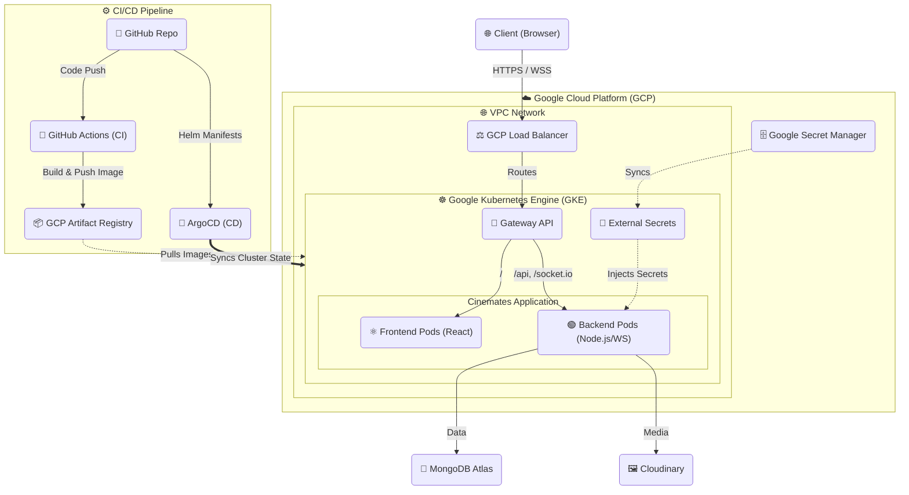

# Cinemates Platform

A production-grade, GitOps-driven cloud infrastructure and deployment platform for the Cinemates full-stack application, built on Google Cloud Platform (GCP).

---

## Overview

This repository contains the complete infrastructure, continuous integration, and continuous deployment configurations for Cinemates. 

It was built to provide a scalable, highly available, and secure environment for a real-time web application. The platform uses Infrastructure as Code (IaC) to provision cloud resources and a GitOps model to manage Kubernetes deployments, ensuring that the entire system state is version-controlled, reproducible, and automated.

---

## Architecture

The system follows a modern cloud-native architecture leveraging GCP managed services and Kubernetes.

### Major Components
- **Frontend**: React Single Page Application (Vite, TailwindCSS, Radix UI) serving the user interface.
- **Backend**: Node.js Express API with WebSocket capabilities (Socket.io) for real-time features, backed by MongoDB and Cloudinary.
- **Infrastructure**: Google Kubernetes Engine (GKE) for container orchestration, provisioned via Terraform.
- **Traffic Management**: Kubernetes Gateway API handles routing external traffic via GCP Load Balancers to the frontend and backend services.
- **Secrets Management**: Google Secret Manager (GSM) integrated with Kubernetes for secure credential injection.
- **Continuous Delivery**: ArgoCD synchronizes cluster state with the `helm-charts` and `argo-apps` directories.

### Data Flow
1. **Client** initiates HTTP/WebSocket requests to the application domains.
2. **GCP Load Balancer** (provisioned via Gateway API) routes traffic to the GKE cluster.
3. **Gateway API Routes** (`HTTPRoute`) direct traffic to either Frontend or Backend pods.
4. **Backend Pods** interact with external services (MongoDB Atlas, Cloudinary) to process business logic and stream real-time events.

### Infrastructure Flow
- **Terraform** provisions foundational GCP resources: VPC, Subnets, IAM roles, Artifact Registry, and the GKE cluster (`infra/` directory).
- Terraform also configures essential GKE add-ons (`infra/gks-addons/`) such as Gateway API controllers and monitoring integrations.

### Deployment Flow
1. **Continuous Integration**: GitHub Actions (`.github/workflows/`) trigger on code pushes.
2. **Build & Push**: Docker images for Frontend and Backend are built and pushed to GCP Artifact Registry.
3. **Manifest Update**: The CI pipeline automatically updates the image tags in the respective Helm chart `values.yaml` files and commits the changes back to the repository (GitOps automation).

---

## Future Improvements

To further enhance the production readiness of this platform, the following enhancements are recommended:

- **Implement Automated Testing**: Add unit, integration, and end-to-end test stages to the CI pipelines to validate code before building images.
- **Infrastructure Security Scanning**: Integrate tools like Checkov, tfsec, or Trivy into the CI pipeline to scan Terraform code and Docker images for vulnerabilities.
- **Disaster Recovery Strategy**: Implement automated backups for cluster state (e.g., using Velero) and establish clear RTO/RPO objectives.
- **Advanced Observability**: Integrate distributed tracing (e.g., OpenTelemetry) to track requests across the network, frontend, backend, and database layers.
- **Environment Promotion Pipeline**: Introduce multi-environment setups (staging, UAT, production) with structured promotion gates rather than deploying directly from a single branch.
- **Dynamic Autoscaling**: Configure Horizontal Pod Autoscaling (HPA) based on custom metrics (such as active WebSocket connections) to scale the backend dynamically during traffic spikes.
